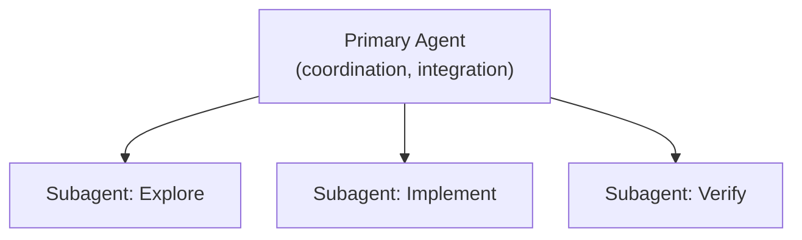
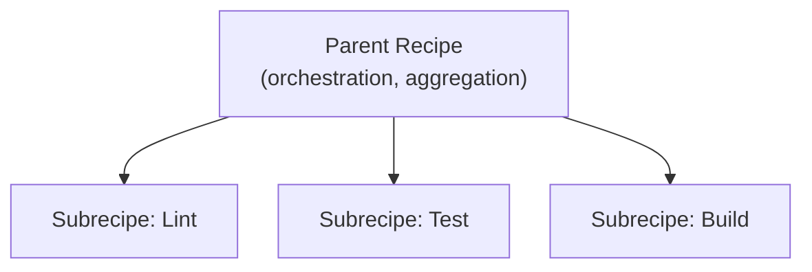
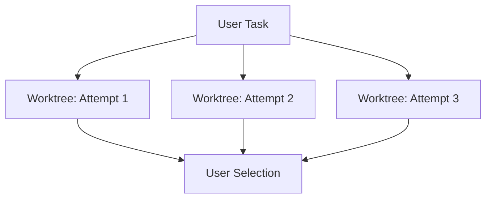
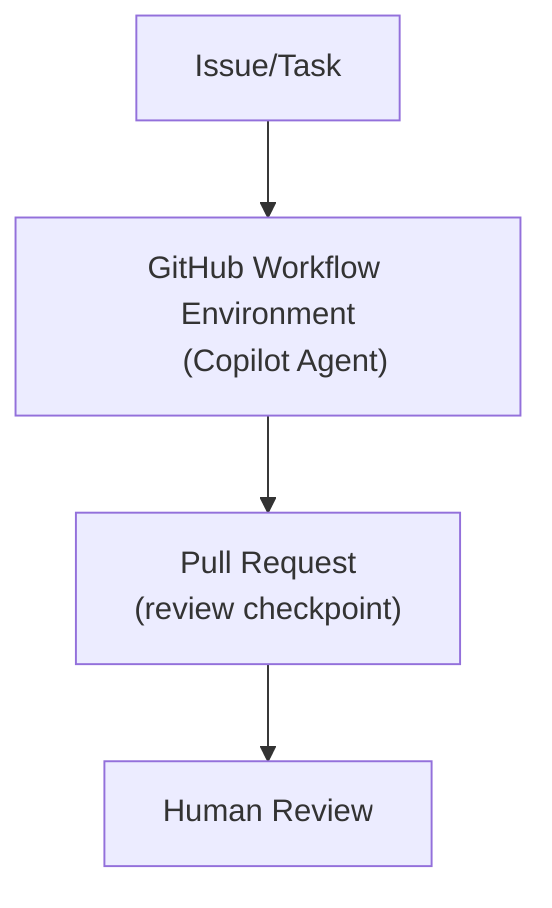

# Tool Analysis

## Introduction

This section provides detailed architectural analysis of four representative agentic development tools. For each tool, we examine:

- Core architectural contributions
- Execution model and context management
- Integration patterns with development workflows
- Current limitations and constraints

The analysis focuses on architectural properties rather than feature comparisons, enabling readers to evaluate tools based on their execution models rather than marketing claims.

**Analysis Approach:** The tools analyzed here have different origins. GitHub Copilot evolved from inline code completion (2021) into chat and eventually a coding agent. Cursor launched as an AI-first IDE with chat and composer as core features from day one. Claude Code and Goose were designed as agentic systems from the start. For each tool, this analysis covers available interfaces, customization options, and core architectural contributions, with deeper focus on the autonomous execution capabilities.

## Claude Code

Claude Code is an agentic development tool designed to operate across terminal, IDE, and CLI environments. Unlike tools that evolved from code completion, Claude Code was built as an agentic system from the start—there is no "assistive mode" versus "agent mode" distinction.

### Architectural Class

Multi-context agent system

### Primary Interface

Terminal, IDE integration, CLI

### Interface Options

Claude Code is available through multiple interfaces, all sharing the same underlying agentic architecture:

**Terminal/CLI**

The primary interface for most users:
- Interactive REPL for conversational development
- Direct command execution and file manipulation
- Full access to local development environment
- Session persistence and history

**IDE Extension**

VS Code integration that brings Claude Code into the editor:
- Sidebar panel for interaction
- Editor context awareness
- Integrated terminal access
- File and selection context

**SDK/API**

Programmatic access for building custom tooling:
- Claude Code can be embedded in automated workflows
- Enables custom orchestration layers
- Powers CI/CD integrations and custom agents

All interfaces provide the same agentic capabilities—the choice is about developer preference and workflow integration rather than capability differences.

### Customization and Configuration

**CLAUDE.md Files**

Project-level context files that inform agent behavior:
- Repository conventions and architecture notes
- Build and test commands
- File structure explanations
- Loaded automatically when entering a project directory

**Slash Commands**

Custom commands defined in `.claude/commands/`:
- Reusable prompts and workflows
- Can include file references and templates
- Team-shareable command libraries
- Invoked with `/command-name` syntax

**Hooks**

Event-driven customization for tool execution:
- Pre and post hooks for tool calls
- Can validate, log, or modify tool behavior
- Enables policy enforcement and auditing
- Configured per-project or globally

**MCP Server Integration**

Extensibility through Model Context Protocol:
- Connect external tools and data sources
- Custom capability development
- Standardized extension interface
- Enables integration with databases, APIs, and services

**Permissions and Allowlists**

Tool access control:
- Configure which tools the agent can use
- Restrict file system access patterns
- Control command execution permissions
- Supports least-privilege configurations

### Architectural Contributions

**Subagent Architecture**

Claude Code implements subagents as pre-configured agent contexts with specific roles, their own context windows, and configurable tool access. This architecture directly addresses the context window limitation that affects all LLM-based tools.

Key properties:
- Each subagent operates within its own context window
- Subagents can be constrained by purpose and permissions
- The primary agent coordinates delegation and result integration
- Subagent configurations can be customized for specific workflows

**Context Isolation**

Each subagent uses its own context window, reducing contamination between planning, exploration, and implementation work. This isolation prevents:

- Exploration results from polluting implementation context
- Implementation details from affecting high-level planning
- One subtask's failures from corrupting another's progress

**Role Specialization**

Different subagents can be constrained by purpose and tool permissions, enabling least-privilege patterns. Example specializations:

- **Exploration agents:** Read-only access for codebase investigation
- **Implementation agents:** Write access scoped to specific directories
- **Verification agents:** Test execution without production access

**Delegation and Reintegration**

A primary agent delegates subtasks and integrates results, enabling decomposition without forcing developers to manually manage separate threads. The delegation pattern:

1. Primary agent receives complex task
2. Primary agent identifies decomposition strategy
3. Subtasks dispatched to appropriate subagents
4. Subagent results returned to primary context
5. Primary agent synthesizes and continues

### Execution Model



### Integration Patterns

**With Specification-Driven Development:**

Claude Code can integrate with SDD workflows through:
- Slash commands that load specification context
- Subagents specialized for specification verification
- Custom instructions that enforce specification compliance

For more on SDD frameworks, see [Spec-Driven Development Framework Patterns](/papers/sdd-frameworks/).

**With Version Control:**

- Direct git integration for commits and branches
- Awareness of repository state and history
- PR creation through CLI tools

### Current Limitations

**Delegation is not fully inspectable:** Delegation decisions are partially implicit and not fully user-configurable in a way that always makes the "why" and "when" obvious during execution. Developers may not always understand when and why subagents are invoked.

**Orchestration complexity:** Multi-context coordination introduces failure modes when subagent outputs conflict, duplicate work, or make incompatible assumptions. Debugging requires understanding the delegation structure.

**Local execution dependencies:** Outcomes and reproducibility depend on the developer's machine configuration unless teams standardize environments. Different developers may get different results for identical prompts.

---

## Goose

Goose is an open-source AI agent project from Block. Like Claude Code, Goose was designed as an agentic system from the start rather than evolving from code completion. Its defining architectural characteristic is recipe-based workflow orchestration, with optional subrecipes for decomposition.

### Architectural Class

Multi-context agent system

### Primary Interface

CLI, Desktop Application

### Interface Options

**CLI**

Command-line interface for terminal-based workflows:
- Session-based interaction model
- Recipe execution from command line
- Scriptable for automation
- Lightweight resource footprint

**Desktop Application**

GUI application for visual interaction:
- Session management with history
- Recipe browsing and selection
- Extension configuration interface
- More accessible for users less comfortable with terminal

Both interfaces provide equivalent agentic capabilities—the desktop app is essentially a GUI wrapper around the same underlying engine.

### Configuration and Extensibility

**Profiles**

Named configurations that bundle settings:
- Model provider and selection
- Default extensions
- System prompt customizations
- Quick switching between configurations

**Extensions (MCP Servers)**

Goose uses MCP (Model Context Protocol) as its primary extension mechanism:
- Built-in extensions for common operations (filesystem, GitHub, etc.)
- Community and custom extensions
- Declarative extension configuration per recipe
- Enables integration with external tools and services

**Session Management**

Persistent session state across interactions:
- Resume previous sessions
- Session history and context
- Named sessions for different projects
- Session export and sharing

### Architectural Contributions

**Recipe System**

Recipes package instructions, extensions, and parameters into reusable workflows. A recipe defines:

- System prompts and instructions
- Enabled extensions and MCP servers
- Context sources and initialization
- Output expectations and formats

Recipe example structure:
```yaml
name: code-review
description: Comprehensive code review workflow
extensions:
  - github
  - filesystem
instructions: |
  Review the provided code changes for:
  - Correctness and potential bugs
  - Style and conventions
  - Performance implications
  - Security considerations
```

**Subrecipes for Decomposition**

Subrecipes enable a parent recipe to invoke specialized workflows. This provides explicit multi-context delegation where:

- Parent recipe defines overall objective
- Subrecipes handle specific subtasks
- Results flow back to parent context
- Delegation structure is declarative and versionable

Note: Goose documentation describes subrecipes as experimental and subject to change.

**Sequential and Parallel Workflow Patterns**

Goose supports both sequential subrecipe execution and guidance for running subrecipes in parallel patterns. This enables:

- Pipeline-style workflows with ordered steps
- Fan-out patterns for independent subtasks
- Aggregation of parallel results

**MCP-Oriented Extensibility**

Goose treats MCP (Model Context Protocol) servers as key extension points for adding capabilities beyond code manipulation. This enables:

- Integration with external tools and services
- Custom capability development
- Standardized extension interface

**Open Source Foundation**

Goose's open source model allows deep customization and internal governance:

- Organization-specific extensions and recipes
- Custom workflow development
- Internal recipe libraries
- Transparent execution model

### Execution Model



### Integration Patterns

**With Specification-Driven Development:**

Goose recipes can encode SDD workflows:
- Specification validation recipes
- Implementation recipes constrained by specs
- Verification recipes that check compliance

**With Version Control:**

- Git operations through extensions
- Recipe-defined commit patterns
- Branch management workflows

**With CI/CD:**

- Recipes as shareable workflow definitions
- Consistent execution across environments
- Integration with automation pipelines

### Current Limitations

**Recipe ecosystem maturity:** Recipe discovery, versioning, and standardization are still emerging. Teams may need to build and maintain internal workflow infrastructure rather than leveraging community patterns.

**Orchestration debugging:** When a multi-step recipe fails, diagnosing where failure occurred and which context caused it can be difficult. Error propagation through recipe chains requires careful handling.

**Local execution model:** Like other local tools, reproducibility depends on environment standardization. Recipes may behave differently across developer machines with different configurations.

**Subrecipe stability:** As an experimental feature, subrecipes may change in ways that affect existing workflows. Organizations should plan for potential migration.

---

## Cursor

Cursor is an AI-first IDE built as a fork of Visual Studio Code. Unlike GitHub Copilot which added AI features to an existing product, Cursor was designed from launch with AI chat and composer as core capabilities. It offers multiple interaction modes spanning a spectrum from lightweight assistance to autonomous execution.

### Architectural Class

IDE-native autonomous agent

### Primary Interface

IDE (VS Code fork)

### Interaction Modes Overview

Cursor provides several distinct interaction modes, each suited to different development contexts:

**Tab Completion**

Inline code suggestions that autocomplete as you type. This is the lightest-touch interaction:
- Single-line and multi-line completions
- Context-aware suggestions based on surrounding code
- Accept/reject with keyboard shortcuts
- No explicit prompting required

**Chat**

Conversational interface for questions and guidance:
- Ask questions about code, errors, or implementation approaches
- Reference files and symbols with @ mentions
- Responses appear in a sidebar panel
- Does not directly modify files

**Cmd+K (Inline Editing)**

Prompt-driven editing within the editor:
- Select code and describe desired changes
- Generates diffs for review before applying
- Scoped to selected region or current file
- User approves each change

**Agent Mode**

Autonomous multi-step execution (detailed below):
- Plans and executes toward a stated objective
- Creates, modifies, and deletes files
- Runs terminal commands
- Iterates on errors

**Background Agents (Parallel Worktrees)**

Multiple autonomous attempts in isolated git worktrees (detailed below).

### Customization and Configuration

**Rules Files**

Cursor supports rules files (`.cursor/rules` or `.cursorrules`) that constrain and guide agent behavior:
- Project-specific instructions and conventions
- Code style and architecture guidelines
- File and directory restrictions
- Custom prompts loaded automatically

Rules files allow teams to encode standards that apply across all Cursor interactions, providing a form of declarative configuration similar to Goose's recipes but scoped to the IDE context.

### Architectural Contributions (Agent Mode Focus)

The remainder of this analysis focuses on Agent mode and parallel worktrees, which represent Cursor's approach to autonomous task execution.

**Deep IDE Integration**

Cursor inherits the VS Code ecosystem, providing:

- Full extension compatibility
- Workspace and project awareness
- Integrated debugging workflows
- Familiar keybindings and interface

This integration means developers can adopt Cursor without changing their existing VS Code workflows.

**Codebase Understanding**

Cursor relies on indexing and context retrieval to support multi-file reasoning and edits:

- Automatic codebase indexing
- Semantic code search
- Cross-file reference resolution
- Project structure awareness

**Agent Mode Autonomy**

Agent mode enables multi-step task execution:

- Multi-file edits without per-file approval
- Command execution and iteration
- Error detection and correction attempts
- Progress toward stated objective

**Parallel Worktrees (Background Agents)**

Cursor's parallel agents feature runs multiple attempts in separate git worktrees, enabling independent solution exploration without interference:

- Each attempt operates in isolated worktree
- No coordination between parallel executions
- User selects best outcome from attempts
- Useful for exploring solution space

This is best understood as parallel exploration, not coordinated multi-agent orchestration. Each attempt is a single-agent execution; parallelism provides selection, not collaboration.

### Execution Model



### Integration Patterns

**With Specification-Driven Development:**

Cursor can work with specification files:
- Specification files in workspace for context
- Rules files to constrain agent behavior
- Manual specification verification

**With Version Control:**

- Git integration through VS Code
- Worktree management for parallel attempts
- Standard commit and branch workflows

### Current Limitations

**Single-agent execution per attempt:** Each attempt operates as one agent context. Parallel attempts improve search over solutions but do not create collaboration among specialized roles. Complex tasks may benefit from explicit decomposition that parallel attempts do not provide.

**No explicit context isolation within an attempt:** The same context is used across planning and execution within an attempt, which can increase scope creep on complex tasks. Unlike multi-context systems, there is no architectural separation between exploration and implementation.

**Local governance only:** Guardrails are policy and practice dependent, not enforced by architecture. Organizations must rely on team discipline and code review to maintain standards.

---

## GitHub Copilot

GitHub Copilot originated as an assistive code completion system and has expanded into a suite of AI-powered development features spanning inline assistance to autonomous task execution.

### Architectural Class

Platform-embedded workflow agent

### Primary Interface

IDE integration, GitHub Platform

### Product Suite Overview

GitHub Copilot encompasses multiple capabilities that serve different development contexts:

**Inline Code Completion**

The original Copilot experience—real-time code suggestions as you type:
- Context-aware completions based on surrounding code and comments
- Multi-line suggestions including entire function bodies
- Works across supported IDEs (VS Code, JetBrains, Neovim, etc.)
- No explicit prompting required

This remains the most widely used Copilot feature for day-to-day development.

**Copilot Chat**

Conversational interface available in IDE and on GitHub.com:
- Ask questions about code, explain errors, suggest refactors
- Reference files and symbols with context
- Available in editor sidebar and GitHub web interface
- Can generate code snippets but requires manual application

**Code Review (Copilot in Pull Requests)**

Automated review suggestions on pull requests:
- Analyzes PR diffs and suggests improvements
- Comments on potential issues, style violations, bugs
- Integrated into GitHub's PR review workflow
- Suggestions require human approval to apply

**Copilot CLI**

Command-line assistance for shell commands:
- Explain commands: `gh copilot explain "git rebase -i HEAD~3"`
- Suggest commands: `gh copilot suggest "find large files in repo"`
- Works in terminal outside of IDE context

**Copilot Extensions**

Third-party integrations that extend Copilot's capabilities:
- Connect to external services and APIs
- Custom context sources and actions
- Extensible through GitHub's extension framework

**Coding Agent**

Autonomous task execution via pull requests (detailed below):
- Assigns issues to Copilot for implementation
- Creates and updates PRs autonomously
- Runs in GitHub's managed environment

### Architectural Contributions (Coding Agent Focus)

The remainder of this analysis focuses on the coding agent, which represents GitHub Copilot's approach to autonomous task execution. Unlike the other Copilot features which augment developer workflows, the coding agent operates independently to produce complete pull requests.

**PR-Centric Output**

Copilot coding agent is designed to open pull requests or update existing pull requests, then request human review. This architectural choice:

- Creates explicit checkpoint for review
- Produces auditable artifact
- Integrates with existing PR workflows
- Forces structured output format

**Platform Governance**

The PR workflow creates an enforced checkpoint for review, and platform policies can constrain merges:

- Required reviewers
- Status checks and CI gates
- Branch protection rules
- Audit logging

Governance is architectural, not dependent on developer discipline.

**Actions-Based Execution Model**

GitHub's materials describe the coding agent as running within GitHub's workflow environment, emphasizing safety considerations around workflows and secrets:

- Managed execution environment
- Defined resource boundaries
- Workflow-based triggers
- Secret management integration

### Execution Model



### Integration Patterns

**With Specification-Driven Development:**

Copilot can integrate with SDD through:
- Issue templates with specification references
- PR templates requiring specification compliance
- CI checks that verify specification adherence

See [Spec-Driven Development Framework Patterns](/papers/sdd-frameworks/) for framework-specific integration patterns.

**With CI/CD:**

- Native GitHub Actions integration
- Status checks as quality gates
- Deployment workflow triggers

### Current Limitations

**Single-agent execution per task:** Each coding agent session behaves as a single workflow agent. There is no explicit multi-context delegation or role specialization within a session.

**Platform constraints:** Work is bounded by what is feasible in the GitHub environment:

- Runner access and capabilities
- Secret availability and management
- Workflow approval requirements
- Network and resource limits

**Latency compared to local interactive loops:** The PR loop can slow iteration for exploratory work. Each iteration requires:

- Agent execution in workflow environment
- PR creation or update
- Review and feedback
- Another agent iteration

This loop is appropriate for well-defined tasks but may frustrate rapid exploration.

**Workflow safety considerations:** GitHub highlights that workflows may not run automatically when Copilot pushes changes, and that workflows can expose secrets, requiring careful review before running.

---

## Summary

| Tool | Architectural Class | Key Strength | Primary Constraint |
|------|---------------------|--------------|-------------------|
| **Claude Code** | Multi-context agent | Explicit context isolation via subagents | Delegation visibility |
| **Goose** | Multi-context agent | Declarative workflow definitions (recipes) | Recipe ecosystem maturity |
| **Cursor** | IDE-native agent | Deep IDE integration, parallel exploration | Single-context per attempt |
| **GitHub Copilot** | Platform-embedded | Architectural governance via PR workflow | Platform execution constraints |

The following section provides comparative analysis across these tools, examining architectural tradeoffs and failure modes in detail.

---

*This analysis was created with AI assistance. Tools analyzed from official documentation and public materials. Data as of January 2026.*
