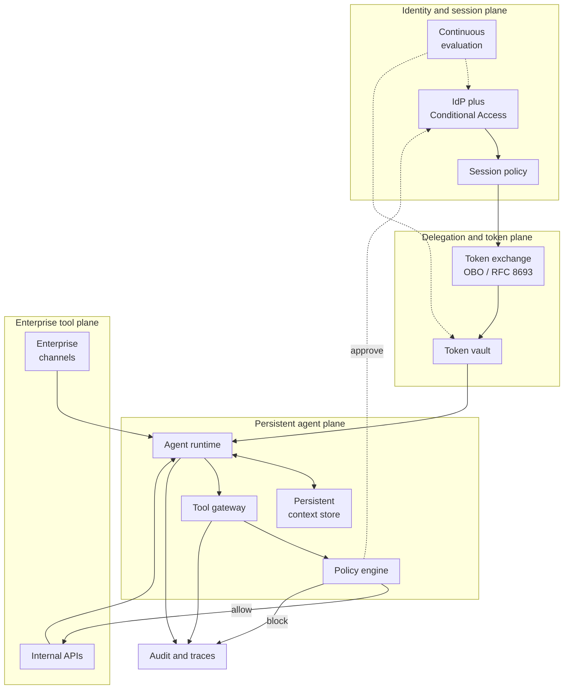

# Always-On Enterprise Agents: Persistent Architecture, Delegated Identity, and the Productivity Hypothesis

*From the Scaling Agentic Development for Enterprise Teams research series*

**Published:** April 2026 | **Author:** David Daniel

**Target Audience:** Software architects, platform engineers, and enterprise decision-makers evaluating persistent AI agent systems

---

## Abstract

Enterprise agent systems are converging on a long-running shape: durable state outside a single model context window, asynchronous continuation across multiple request/response cycles, and enforceable boundaries where text becomes action. Multiple independent vendor ecosystems now describe long-horizon agents as a first-class deployment target rather than an edge case.

This convergence introduces a structural constraint. This paper argues that enterprise productivity gains from AI are most likely to emerge when work is delegated to long-running agents operating asynchronously under identity-bound governance, though this hypothesis has not yet been validated at enterprise scale. Without mechanisms to bind autonomous execution to human intent over time, persistent agents remain confined to interactive use, bounded by human working hours and direct supervision.

The constraint required is not improved model reasoning but bounded execution. Identity-bound delegation provides this by ensuring that all agent actions remain attributable, scoped, and revocable. This paper provides a deployment-oriented taxonomy of persistent agent architectural patterns, a reference architecture that anchors agents to identity-scoped sessions with tool-boundary governance, and a productivity hypothesis grounded in cycle-time reduction rather than task-speed improvement.

The analysis draws on primary documentation from OpenClaw, NVIDIA NemoClaw, Anthropic Managed Agents, and Databricks, alongside identity standards (OAuth 2.0 Token Exchange, CAEP) and empirical productivity research.

## Introduction

Earlier work in this research series proposed a framework for enterprise AI scaling, identifying three interdependent factors that together determine reliable output at scale: specification quality, loop autonomy, and context management. The companion article [The Specification Layer](/articles/specification-layer/) argued that machine-readable specifications are the missing foundation for agentic scaling. The companion article [The Autonomous Agents Loop](/articles/autonomous-agents-loop/) argued that longer autonomous execution with multi-agent context management outperforms interactive assistance. This paper extends both arguments into persistent territory: what happens when autonomous execution persists across sessions, hours, and organizational boundaries.

Persistent agents represent a shift in the shape of enterprise automation. Instead of request/response interaction constrained to a chat session, persistent agents retain durable context and produce durable work products across time: plans, tickets, diffs, runbooks, approvals, and tool-executed side effects. Anthropic's Claude Managed Agents is explicitly positioned as "best for long-running tasks and asynchronous work," and its engineering documentation formalizes long-running operation as a durable session log plus a harness that can resume after failure and a sandboxed execution layer that can be replaced without losing the session. Databricks is productizing stateful and long-running agent operation in a governed data platform: Agent Bricks explicitly supports scheduling agents on recurring workflows, capturing tool calls and invocations, and giving agents persistent memory via Lakebase. OpenClaw provides an inspectable open-source example of always-on operation with explicit session lifecycle policies and file-backed memory persistence.

Agents in this context are not interactive tools. They are delegated execution contexts.

This shift introduces a structural constraint. As execution persists beyond a single interaction, actions can outlive the intent that initiated them. This creates a new class of failure mode: systems that continue operating correctly according to their instructions, but incorrectly relative to current human intent. A coding agent that continues refactoring a module after priorities shifted overnight. A triage agent that keeps applying a policy that was updated during the previous business day. A review agent that approves changes using criteria that were superseded by a new compliance requirement.

The central question for enterprise adoption is therefore not only how agents execute, but how their execution remains attributable, scoped, and revocable over time. The enterprise question is whether always-on agent behavior will arrive inside the existing governance perimeter (identity, device posture, audit, approvals) or outside it, through ad hoc tokens, unmanaged chat surfaces, and weak attribution.

Persistent agents are not constrained by execution capability. They are constrained by the ability to bind that execution to human intent over time.

This paper provides three contributions. First, a deployment-oriented taxonomy of persistent agent archetypes grounded in current vendor implementations. Second, a reference architecture that introduces identity anchoring and tool-boundary governance as first-class architectural components alongside persistence and execution. Third, a productivity hypothesis that frames always-on agent value as cycle-time reduction through temporal decoupling, with appropriate empirical constraints.

## Enterprise Agent Archetypes

Persistent agent systems can be understood as a transition across three modes: interactive assistance, where execution is human-driven within a single exchange; delegated execution, where agent-driven tasks operate within a bounded session; and continuous execution, where long-running agents operate across sessions independently of human presence. This paper focuses on the third mode, where the architectural requirements diverge most sharply from conventional tooling.

These archetypes should not be interpreted as variations of a single agent system. They represent a portfolio of delegated execution contexts, each operating with distinct responsibilities, authority boundaries, and lifecycle characteristics. In practice, enterprise deployments are composed of multiple specialized agents operating concurrently, rather than a single general-purpose agent.

### Review agents

Review agents focus on evaluating artifacts produced by humans or other agents: code diffs, pull requests, design docs, compliance checklists, incident postmortems, and vendor contracts. Review behavior appears as an explicit control surface in multiple ecosystems. Databricks' Review App enables subject matter experts to review interactions and feed monitoring and evaluation loops. OpenClaw's optional "dreaming" consolidation writes output into `DREAMS.md` for human inspection. NemoClaw requires operator approval for new network destinations during runtime. Anthropic frames per-action permissions and approval tiers as the control mechanism for trustworthy agents (always allow, needs approval, or block), which provides a natural review-agent policy substrate.

Review agents are distinguished by their read-heavy authority profile and their role as quality gates within larger workflows. Their persistence requirement is primarily context continuity: retaining knowledge of what was previously reviewed, what standards apply, and what exceptions have been granted.

### Coding agents

Coding agents perform incremental changes in version-controlled repositories, with tight tool boundaries and a loop of edit, build/test, observe, and iterate. Anthropic's tool combinations documentation defines the canonical coding loop as `text_editor` + `bash`, and its long-running harness research describes an initializer session plus repeated coding sessions that make incremental progress while leaving structured artifacts (progress logs, commit history) for the next session.

Coding agents are distinguished by their write-heavy but version-controlled authority profile. The version control system provides a natural audit trail and rollback mechanism, making this archetype one of the safest for extended autonomous operation.

### Continuation agents

Continuation agents are designed to outlive a single API timeout or work-hour window. This archetype is directly supported by Databricks' long-running task continuation design, which uses `task_continue_request` and `task_continue_response` loops to break long tasks across multiple request/response cycles. Anthropic's Managed Agents are similarly positioned for asynchronous long-running work in managed infrastructure. OpenClaw's background task ledger provides a complementary open-source model for detached work tracking across cron runs and subagent spawns.

Continuation agents are distinguished by their temporal persistence requirement: they must survive interruptions, timeouts, and session boundaries while maintaining coherent progress toward a goal.

### Governed integration agents

Governed integration agents are specialized to operate against enterprise data and systems (databases, ticketing, CI/CD, CRM) with explicit tool governance. Databricks emphasizes unified governance over agents, tools, and MCP servers with end-to-end permissions, positioning MCP as a single governed protocol for connecting tools and data with centrally managed credentials and audit trails. NemoClaw demonstrates a strict variant: even with tool capability, network egress must be explicitly allowed and can be restricted by executable identity and method/path rules.

Governed integration agents are distinguished by their deep coupling with enterprise systems and the corresponding requirement for fine-grained authorization at every tool boundary.

### Archetype interactions

These archetypes are not isolated. A realistic enterprise deployment might involve a continuation agent that dispatches coding agents for implementation work, with review agents evaluating the output before governed integration agents push changes to production systems. The "always-on" capability is not one agent doing everything, but an ecosystem of specialized supervised agents that interact through durable artifacts (tasks, repos, tickets) and explicit approval gates.

Architectures that support asynchronous continuation and identity-bound delegation make it feasible for a single human to supervise multiple concurrent agent tasks, each progressing independently between review cycles.

## Evidence from Current Systems

The following analysis draws on primary vendor documentation to map how current systems implement persistent agent patterns. Each subsection corresponds to architectural decisions that are citable and verifiable.

### OpenClaw: sessions, background tasks, and scheduled persistence

OpenClaw documents a session routing model where inbound messages are routed to sessions based on origin: direct messages, group chats, rooms/channels, cron jobs, and webhooks. The same documentation defines explicit session lifecycle policies (daily reset by default, optional idle reset, manual reset) and describes session state as gateway-owned and stored with transcripts on disk. This makes session boundaries configurable and explicit rather than implicit in a UI.

OpenClaw also defines background tasks as an activity ledger for detached work outside the main conversation: cron executions, CLI operations, subagent spawns. OpenClaw's documentation explicitly describes tasks as "records, not schedulers," with a task lifecycle (`queued → running → terminal`) and notification delivery semantics. This provides a concrete model for agents that continue running after the initiating message, with a traceable ledger of what happened when work becomes detached.

OpenClaw's persistence strategy is unusually transparent: memory is stored as plain Markdown files (`MEMORY.md` for long-term context; daily notes in `memory/YYYY-MM-DD.md`) and is reloaded automatically at session boundaries, with memory tools for searching and retrieving stored content. The optional "dreaming" feature consolidates memory via a scheduled cron job and writes review artifacts into `DREAMS.md` for human inspection, illustrating an explicit background consolidation and human review loop.

OpenClaw's security guidance is explicit about the operational reality of always-on agents: session identifiers are routing selectors rather than authorization tokens, and if multiple untrusted users can message one tool-enabled agent, they should be treated as sharing delegated tool authority.

*Enterprise implication: Persistence is achieved through explicit externalization of sessions, memory, and task state, rather than reliance on model context alone.*

### NemoClaw: policy-enforced autonomy via sandboxing and egress control

NVIDIA's NemoClaw wraps an OpenClaw deployment in a policy-enforced sandbox (OpenShell). Its architecture splits between a TypeScript plugin integrated with the OpenClaw CLI and a versioned Python blueprint that orchestrates sandbox resources: sandbox creation, policy application, and inference provider setup. OpenShell provides sandbox containers, a credential-storing gateway, inference proxying, and policy enforcement.

NemoClaw's network policies are deny-by-default: only explicitly allowed endpoints are reachable, and unlisted destinations are intercepted and presented to an operator for approve/deny decisions in real time. Its security best practices document binary-scoped endpoint rules (restricting which executables may access an endpoint) with enforcement based on kernel-trusted executable paths and hashing. Each allowed endpoint is framed as a potential exfiltration path.

Inference requests from within the sandbox never leave directly. The sandbox communicates with `inference.local`, and the host retains provider credentials and upstream endpoints. This structurally separates generated code execution from credential ownership, reducing the chance that an agent can trivially read tokens from its own runtime environment.

*Enterprise implication: Autonomous execution is bounded by infrastructure-enforced policy, not by agent reasoning, establishing external control over side effects.*

### Anthropic: managed long-horizon sessions and harness/sandbox separation

Anthropic's [Claude Managed Agents documentation](https://platform.claude.com/docs/en/managed-agents/overview) positions the product as a pre-built, configurable agent harness running in managed infrastructure, designed for long-running tasks and asynchronous work. The [engineering architecture blog](https://www.anthropic.com/engineering/managed-agents) defines the architecture as virtualizing an agent into three interfaces: a durable session (append-only log), a harness (the agent loop and tool routing), and a sandbox (execution environment). Decoupling these components enables recovery from harness failure (reboot a new harness, reload the session event log, resume) and treats sandboxes as replaceable resources provisioned on demand.

The same engineering documentation frames a structural security boundary: untrusted code generated by the model should not run in the same environment as credentials. Two concrete patterns are described: bundling auth with resources during sandbox initialization (e.g., repo token wired into git remote) or storing OAuth tokens in a secure vault and invoking tools through an MCP proxy that fetches credentials from the vault while the harness and sandbox never see them.

Anthropic's research on [effective harnesses for long-running agents](https://www.anthropic.com/engineering/effective-harnesses-for-long-running-agents) frames the long-running problem as bridging discrete sessions where each new session begins without memory of the previous context window. The documented approach for long-horizon coding uses an initializer session that scaffolds environment artifacts plus recurring coding sessions that make incremental progress while leaving structured artifacts (progress logs, commits) for the next session.

*Enterprise implication: Decoupling session, orchestration, and execution enables long-running agents to be recoverable, scalable, and independently governed.*

### Databricks: governed, stateful, schedulable agent deployments

Databricks positions [Agent Bricks](https://www.databricks.com/product/artificial-intelligence/agent-bricks) as a unified platform to build and govern AI agents, explicitly describing persistent memory with Lakebase and the ability to schedule agents on recurring workflows, plus automatic capture of interactions, tool calls, and model invocations. These are direct signals that the platform is designed for always-on and scheduled operation rather than only interactive chat.

Databricks documentation on [AI agent memory](https://docs.databricks.com/aws/en/generative-ai/agent-framework/stateful-agents) defines short-term memory as capturing context within a session using thread IDs and checkpointing, and long-term memory as extracting and storing key information across multiple conversations. LangGraph checkpointing backed by Lakebase provides durable state management, and a template using OpenAI Agents SDK sessions persisted to Lakebase indicates a multi-framework strategy for statefulness. The memory scaling proposal frames the agent's state as living in a persistent store (skills, knowledge, episodic and semantic memory), and positions the LLM as a swappable reasoning engine that reads the same memory store. From this pattern, we infer that long-term differentiation could accrue at the deployment level rather than the model level: the persistent context an agent accumulates over weeks of operation may become its primary asset, independent of which model powers its reasoning. This suggests a shift in differentiation from model capability to accumulated context, potentially making long-running deployments strategically valuable over time.

Databricks also provides an explicit long-running mechanism for complex tasks: Supervisor Agent long-running task mode describes automatic task continuation by breaking long tasks into multiple request/response cycles, emitting `task_continue_request` events, and resuming via follow-up requests until completion. This is a concrete mechanism for agents that keep making progress across multiple cycles without timing out, and can be mapped directly to after-hours progress in enterprise workflows.

Databricks documentation on [agent tools](https://docs.databricks.com/aws/en/generative-ai/agent-framework/agent-tool) treats tool access as a centrally governed surface, with managed MCP servers handling third-party integrations under shared credentials. A Review App lets subject matter experts evaluate agent output after the fact, a pattern that becomes essential when agents produce work products outside business hours that require review before they take effect.

The governance dimension is anchored to Unity Catalog, which extends existing enterprise access control and audit primitives to agent and tool actions at the organizational level rather than per-agent.

The Databricks-Anthropic partnership reinforces this division: Claude models provide the reasoning layer, while Databricks provides the governance, persistence, and deployment infrastructure that turn long-running agents into operational systems.

*Enterprise implication: Persistent agents become operational systems when integrated with scheduling, stateful storage, and enterprise governance frameworks. Databricks demonstrates this most explicitly by treating agent deployment as a governed data platform concern rather than an application-layer concern.*

## The Identity Anchor: Agents as Delegated Actors

Long-running agents introduce a failure mode that does not exist in interactive systems: execution that outlives the intent that initiated it. In a request-response model, intent and execution are tightly coupled in time. In persistent systems, this coupling breaks: work continues after the initiating context has changed, expired, or become invalid. The constraint required is not improved reasoning but bounded execution, and identity-bound delegation is the mechanism that provides it. This is what makes always-on agents deployable in real organizations, not merely technically possible.

### Delegated identity model

Persistent agents are best modeled, we argue, as delegated actors rather than independent identities. Three roles separate concerns cleanly:

The **subject** is the human principal whose intent is being carried forward. The **actor** is the agent runtime (a workload identity) performing tool calls on behalf of the subject. The **delegation chain** is the cryptographic and policy-bound record that the actor is permitted to act for the subject, scoped to a time window, audience, and action set.

OAuth 2.0 Token Exchange ([RFC 8693](https://datatracker.ietf.org/doc/html/rfc8693)) defines a Security Token Service style protocol for exchanging tokens, explicitly supporting delegation and impersonation semantics. Identity vendors are operationalizing this pattern: Ping Identity's materials frame "delegation instead of impersonation," describing tokens that carry both the human subject identity and the agent identity via `act`/`may_act` claims, preserving an auditable chain of custody for downstream authorization decisions. Microsoft Entra describes agent identities (currently in preview) as specialized identity constructs for AI agents, arguing that identity models designed for humans and applications are insufficient as organizations deploy autonomous systems at enterprise scale.

### What identity-bound governance enables

From the vendor-documented patterns analyzed in this paper, identity-bound delegation enables four properties required for always-on systems.

**Attribution.** Every tool call is traceable to an initiating subject, even when execution occurs asynchronously or outside working hours. This resolves the auditability gap that emerges when work happens without a human present.

**Revocation.** Execution can be halted when intent changes. Long-running agents do not require explicit shutdown; their authority can expire or be withdrawn. The OpenID CAEP specification defines continuous access evaluation signals intended to attenuate access for human or robotic users, devices, sessions, and applications. Microsoft Entra describes CAE as an industry standard based on CAEP with near real-time enforcement goals.

**Scoped authority.** Work can be assigned to agents without granting permanent or shared credentials. Authority is scoped to the specific task and context, preventing what we term the "authorization outlives intent" failure mode, a risk pattern consistent with the identity concerns Okta raises in its agent token exchange guidance for always-on agents.

**Isolation.** Agents operating in shared environments do not inherit shared authority. Each task remains bound to its originating identity and scope, addressing the multi-user authority collapse risk documented in OpenClaw's security guidance.

These properties are not enhancements. They are prerequisites for allowing agents to operate continuously within enterprise systems. Identity-bound governance constrains execution, not cognition; it does not improve model reasoning or guarantee correctness of outputs. Its role is to ensure that when agents act, they do so within enforceable and observable boundaries.

## Reference Architecture

The architectural patterns observed across current systems can, we propose, be unified by introducing identity and delegation as first-class components. Persistence, execution, and governance are not independent concerns. They are coupled through the requirement that long-running work remains bound to its originating intent.

The following reference architecture organizes persistent agent infrastructure into four planes.

### Architecture diagram



### Component mappings to citable building blocks

**Identity & session plane.** User authentication flows through existing IdP infrastructure. Okta's global session policies explicitly support prompting frequency (setting the time before prompting for another challenge), which provides a native control plane for bounded agent session renewal. Google's session controls configure how often users must re-authenticate and whether full login, password-only, or hardware security key is required, directly supporting agent check-in renewal cadences. Microsoft Entra's Conditional Access policies enforce device compliance gates (via Intune) and granular step-up authentication using authentication context, enabling device-posture-gated agent session initiation and renewal. These are not new infrastructure requirements. They are existing enterprise controls extended to cover a new class of workload: the persistent agent.

**Delegation & token plane.** A token exchange or on-behalf-of flow mints a downscoped delegated token for the agent runtime. Okta documents OBO token exchange as retaining user context in requests to downstream services. Okta's agent-specific token exchange guidance (Early Access) explicitly positions token exchange as the mechanism to let AI agents access protected resources on behalf of authenticated users. Token Exchange ([RFC 8693](https://datatracker.ietf.org/doc/html/rfc8693)) provides the protocol backbone as a standards-based mechanism for exchanging tokens, explicitly supporting delegation and impersonation use cases. Ping Identity's delegation framing embeds both identities in the token, the human subject (`sub`) and the agent actor (`act`/`may_act`), preserving an auditable chain of custody for downstream authorization decisions.

Refresh token rotation (documented by both Okta and Auth0) minimizes replay risk and reduces the blast radius of stolen tokens in long-lived delegated systems. Auth0's Continuous Session Protection provides customizable session and refresh token management controls for enterprise security requirements, including revocation and tailored lifetimes.

The token vault stores credentials outside agent memory and execution environments, implementing the structural credential isolation described in Anthropic's managed agents documentation. This is not cosmetic: untrusted generated code can access credentials in the same container environment, and the structural fix is to keep tokens unreachable from the sandbox. Two concrete patterns are documented: bundling auth with resources during sandbox initialization (e.g., repo token wired into git remote) or storing OAuth tokens in a secure vault and invoking tools through an MCP proxy that fetches credentials from the vault while the harness and sandbox never see them.

**Persistent agent plane.** The durable session log maps to Anthropic's session as an append-only log outside the harness and sandbox, retrievable as an event stream. This enables recovery from harness failure: reboot a new harness, reload the session event log, resume. Task records and provenance map to OpenClaw's background task ledger for detached work (cron runs, subagent spawns, CLI runs), where tasks function as traceable activity logs rather than execution triggers (described in OpenClaw's documentation as "records, not schedulers"), with explicit lifecycle tracking (`queued → running → terminal`) and notification delivery semantics. Memory and checkpoints map to Databricks agent memory with Lakebase as a durable store (short-term via thread IDs and checkpointing, long-term across sessions) and to OpenClaw's file-backed `MEMORY.md` persistence with optional scheduled consolidation via dreaming jobs. The policy/approval gate maps to NemoClaw's operator approval for unlisted network destinations and to Anthropic's per-action permissions model (always allow / needs approval / block).

**Enterprise tool plane.** All tool access is mediated through a gateway and policy enforcement point. Continuation maps to Databricks' task continuation mechanism for long tasks exceeding timeouts (`task_continue_request` / `task_continue_response` loops) and to Anthropic's asynchronous long-running work positioning. AWS AgentCore Gateway positions itself as a secure connectivity layer converting APIs and Lambda functions into MCP-compatible tools reachable through gateway endpoints. Databricks' tool integration via managed MCP servers with managed OAuth and a connections proxy provides a governed variant where credential management and access control are centralized in Unity Catalog rather than managed per-agent.

### Operational flows

**Session initiation and delegation.** A user authenticates via SSO under existing policies: MFA, conditional access, device posture. Okta global session policies explicitly support prompting frequency, and Google session controls explicitly support reauthentication methods and intervals. A token exchange or OBO flow mints a downscoped delegated token for the agent runtime. Okta documents OBO token exchange as preserving user context in downstream requests. The agent begins work with bounded authority that is traceable to the initiating user, and the delegated token encodes both who requested (subject) and what acts (actor) for downstream authorization decisions.

**Renewable sessions and continuous evaluation.** The delegated token is short-lived; renewals occur through controlled exchanges. CAEP defines continuous updates enabling receivers to attenuate access to sessions, devices, and robotic users. Microsoft Entra describes CAE as an industry standard based on CAEP with near-real-time enforcement goals, though with possible latency due to event propagation. Practically, this enables revocation on critical events (risk changes, device posture changes, policy updates) rather than waiting for access token expiry. A deployment should measure end-to-end revocation latency to ensure the governance expectation is met.

**Token vaulting and credential lifecycle.** Refresh tokens and delegated credentials are stored in a dedicated token vault rather than in agent memory or local files. Refresh token rotation guidance from Okta and Auth0 highlights rotation behavior and revocation implications as first-class controls. OAuth Security Best Current Practice ([RFC 9700](https://datatracker.ietf.org/doc/rfc9700/)) updates threat modeling for broad OAuth usage and provides a suitable baseline for vault design. The vault is a structural control: it ensures that even if the agent's execution environment is compromised, credentials are not directly accessible.

**Tool execution via gateway and policy engine.** All tool calls traverse a single gateway that enforces allow/approve/block decisions, records traces, and integrates step-up authentication or human review where needed. The gateway is the enforcement boundary: the agent cannot bypass it. OpenAI's guardrails documentation defines human review as a runtime pause that gates sensitive tool actions, supporting enforceable approvals without breaking workflow continuity. AWS AgentCore Gateway and Ping Identity's agent gateway framing each implement this as a first-class architecture layer: a security proxy validating delegation tokens and enforcing runtime authorization in front of protected resources. NemoClaw's deny-by-default egress implements the same principle at the environment boundary, intercepting unlisted destinations and surfacing them for operator approval in real time.

**After-hours progress.** The user initiates a task, the system produces a task record with provenance (who, why, when), and the harness continues running the work loop until the next check-in point or approval gate, emitting updates back to the initiating user. The delegated token's lifetime and renewal requirements ensure that work does not continue indefinitely without governance checks. Anthropic's long-running harness research describes this explicitly: an initializer session scaffolds environment artifacts, then recurring coding sessions make incremental progress while leaving structured artifacts (progress logs, commits) for the next session. The system is designed for multi-session work spanning hours or days, with each session's output serving as input for the next.

**Observability and audit.** Every tool call, approval decision, and state transition is recorded in an event log or trace store. OpenAI's Agents SDK tracing collects a record of events including tool calls and guardrails, supporting auditability. Databricks emphasizes capturing every interaction and tool call for monitoring, and provides evaluation loops via LLM judges and custom metrics on traces. OpenClaw's background task ledger frames detached work as records with explicit lifecycle tracking and notification semantics. These converge on a unified pattern: persistent agents require persistent ledgers with auditability, because asynchronous work must be observable to be governable.

## The Productivity Hypothesis

The productivity implications of long-running agents do not arise from faster responses. They arise from temporal decoupling.

Interactive systems are bounded by human working time. Persistent systems are bounded by system constraints (compute, API rate limits, and policy gates) rather than by whether a human is actively watching.

### The core mechanism: cycle-time reduction

The primary mechanism is cycle-time reduction. In workflows dominated by latency and iteration, significant time is spent waiting: for builds, for test results, for data retrieval, or for intermediate decisions. Long-running agents convert this idle time into execution time by continuing work between human interactions. The result is not necessarily faster individual steps, but shorter end-to-end completion time.

From the vendor documentation analyzed in this paper, a testable productivity hypothesis emerges:

> When agents can continue making incremental progress between human check-ins, they can shorten end-to-end cycle time for multi-step workflows by converting idle and wait time into progress time.

This hypothesis is strongest for workflows dominated by latency and iteration: running tests, waiting for builds, collecting data, executing multi-step tool chains, or performing repeated review and triage. The long-running harness strategy in Anthropic's research explicitly treats long-horizon coding as incremental progress across sessions, with artifacts for the next session to reduce rework. Databricks' Supervisor long-task mode similarly treats long tool-call sequences as resumable across cycles rather than failing at a timeout boundary.

### Coverage, not speed

The productivity model implied by persistent agents is fundamentally different from the interactive assistance model.

| Model | Constraint | Productivity lever |
|---|---|---|
| Human + interactive copilot | Bounded by human working hours | Individual task speed |
| Human + always-on agents | Bounded by system constraints | Temporal coverage and throughput |

The argument is that productivity equals time multiplied by coverage, not speed alone. A developer who dispatches three coding agents at end-of-day (one running tests against a refactored module, one collecting benchmark data, one triaging a backlog of lint warnings) returns the next morning to completed work products rather than a cold start. The developer's own speed has not changed. The workflow's cycle time has compressed because idle hours became execution hours.

A common pattern where this effect is most visible is CI/CD pipelines, where build, test, and validation steps are inherently asynchronous. Persistent agents can orchestrate these steps continuously (triggering the next stage as soon as the previous one completes, handling transient failures with retries, and collecting results for human review), reducing idle time between stages without requiring human re-initiation at each step.

### Empirical constraints

This effect is not universal. Tasks requiring continuous human judgment or high-context decision-making do not benefit from asynchronous continuation. Empirical evidence on AI-assisted productivity remains mixed, suggesting that gains depend on workflow structure rather than tool capability alone.

A field experiment analysis of GitHub Copilot ([Cui et al., MIT GenAI](https://mit-genai.pubpub.org/pub/v5iixksv)) reports suggestive increases in pull requests completed per week in some organizational settings, though the authors emphasize limitations such as compliance and precision. Conversely, a randomized controlled trial of experienced open-source developers ([Becker et al., METR, arXiv:2507.09089, July 2025](https://metr.org/blog/2025-07-10-early-2025-ai-experienced-os-dev-study/)) reported that allowing AI tools increased completion time by 19%, contradicting developer expectations.

A paper arguing for beyond-work-hours productivity is therefore strongest when it frames the claim as enabled by long-running architectures documented by vendors and requiring enterprise evaluation metrics (cycle time, PR lead time, defect rate, human review load) rather than relying on sentiment or self-reported speed. The productivity hypothesis is testable. It has not yet been tested at enterprise scale.

## Comparison Table

The following table compares representative systems across the architectural dimensions analyzed in this paper. "Unspecified" indicates the relevant primary documentation does not clearly describe the attribute.

| Solution | Persistence model | Identity anchoring | Policy / gateway | Status |
|---|---|---|---|---|
| **OpenClaw** | File-backed memory (`MEMORY.md`, daily notes) loaded automatically; gateway-centric architecture | Unspecified; security guidance notes routing keys are not authorization | Gateway is control plane; exec approvals as intent guardrails | OSS (MIT), active |
| **NemoClaw** | Persistent sandbox workspace files; explicit sandbox policy model | Unspecified | Deny-by-default egress; operator approval on unlisted destinations; OpenShell policy layers | OSS (Apache-2.0), alpha |
| **Anthropic Managed Agents** | Append-only session log; harness/sandbox separation; session survives harness failure | Credential vaulting via MCP proxy; structural sandbox isolation | Per-action permissions (allow/approve/block); sandboxed execution | Managed, production |
| **Databricks Agent Bricks** | Lakebase-backed memory; thread checkpointing; long-term cross-session memory | IAM-centric; Unity Catalog governance | MCP servers; managed OAuth; connections proxy; task continuation | Managed, production |
| **LangGraph** | Built-in checkpoint persistence; state saved per step, organized into threads | Unspecified | HITL via persistence; gateway primitives unspecified | OSS (MIT), mature |
| **OpenAI Agents SDK** | Application-defined persistence; SDK provides orchestration, tracing, approvals | Unspecified | Guardrails and human review; tracing and handoffs as first-class primitives | OSS (MIT), vendor SDK |
| **AWS Bedrock Agents** | Managed construct; tool actions formalized via action groups | IAM-centric | Action groups; AgentCore Gateway as tool connectivity layer | Managed (AWS), production |

Two patterns emerge from this comparison. First, based on the documentation surveyed, identity anchoring appears to be the least mature dimension across the landscape; most systems treat it as an external concern rather than a first-class architectural component, and several major frameworks leave it entirely unspecified. Second, policy and gateway primitives are increasingly built into agent platforms rather than bolted on, suggesting convergence toward tool-boundary governance as a baseline expectation.

## Conclusion

Persistent agents are a structural evolution of enterprise automation. They extend work across time, retain durable context, and act through tools. The enterprise control problem is not whether agents are safe in the abstract, but whether agent autonomy is bounded by renewable sessions, attributable to human intent, and enforced at unbypassable control points.

This paper has argued that always-on agents become deployable, not merely technically possible, when three conditions are met. First, persistence is externalized: sessions, memory, and task state live outside the model context window in durable, inspectable stores. The evidence from OpenClaw, Anthropic, and Databricks demonstrates convergence on this pattern. Second, execution is identity-bound: every action traces to a human subject through a delegation chain that can be audited, scoped, and revoked. Identity standards (RFC 8693, CAEP) and vendor implementations (Okta, Microsoft Entra, Ping Identity) provide the protocol infrastructure. Third, tool boundaries are governed: a gateway and policy engine mediate all side effects, enforcing allow/approve/block decisions independently of the agent's reasoning.

These three conditions map directly to the framework established in earlier work in this series. Specification quality defines what an agent should do. Loop autonomy defines how it executes. Persistent context management sustains execution across time. And identity-bound governance ensures that sustained execution remains aligned with human intent, not through prompt discipline, but through structural enforcement.

The productivity hypothesis, that always-on agents compress cycle time by converting idle hours into execution hours, is grounded in the architectural capabilities described in this paper, not in empirical proof of enterprise-scale gains. It is, however, not yet validated at enterprise scale. Organizations evaluating persistent agent deployments should instrument for cycle time, throughput, and review load rather than relying on self-reported productivity gains.

The transition from interactive copilots to persistent agents is not incremental. It is a shift from tools to infrastructure. Identity-bound governance is what makes that shift viable.

---

## References

### Agent Platforms & Infrastructure

- Anthropic. "Claude Managed Agents Overview." https://platform.claude.com/docs/en/managed-agents/overview
- Anthropic. "Managed Agents Architecture." https://www.anthropic.com/engineering/managed-agents
- Anthropic. "Effective Harnesses for Long-Running Agents." https://www.anthropic.com/engineering/effective-harnesses-for-long-running-agents
- Anthropic. "Trustworthy Agents in Practice." https://www.anthropic.com/research/trustworthy-agents
- OpenClaw. "Session Management." https://docs.openclaw.ai/concepts/session
- OpenClaw. "Background Tasks." https://docs.openclaw.ai/automation/tasks
- OpenClaw. "Memory Overview." https://docs.openclaw.ai/concepts/memory
- OpenClaw. "Security Model." https://docs.openclaw.ai/gateway/security
- NVIDIA. "NemoClaw Architecture." https://docs.nvidia.com/nemoclaw/latest/reference/architecture.html
- NVIDIA. "NemoClaw Network Policies." https://docs.nvidia.com/nemoclaw/latest/reference/network-policies.html
- NVIDIA. "OpenShell Security Best Practices." https://docs.nvidia.com/openshell/security/best-practices
- Databricks. "Agent Bricks." https://www.databricks.com/product/artificial-intelligence/agent-bricks
- Databricks. "AI Agent Memory." https://docs.databricks.com/aws/en/generative-ai/agent-framework/stateful-agents
- Databricks. "Agent Tools." https://docs.databricks.com/aws/en/generative-ai/agent-framework/agent-tool
- AWS. "Agentic AI Security Best Practices." https://docs.aws.amazon.com/prescriptive-guidance/latest/agentic-ai-security/best-practices.html
- AWS. "Bedrock Agents Action Groups." https://docs.aws.amazon.com/bedrock/latest/userguide/agents-action-create.html
- AWS. "AgentCore Gateway." https://docs.aws.amazon.com/bedrock-agentcore/latest/devguide/gateway.html

### Identity & Governance

- IETF. "OAuth 2.0 Token Exchange." RFC 8693. https://datatracker.ietf.org/doc/html/rfc8693
- IETF. "OAuth 2.0 Security Best Current Practice." RFC 9700. https://datatracker.ietf.org/doc/rfc9700/
- OpenID Foundation. "CAEP 1.0 (Continuous Access Evaluation)." https://openid.net/specs/openid-caep-1_0-final.html
- Microsoft. "Continuous Access Evaluation (CAE)." https://learn.microsoft.com/en-us/entra/identity/conditional-access/concept-continuous-access-evaluation
- Microsoft. "Agent Identities (Entra Agent ID)." https://learn.microsoft.com/en-us/entra/agent-id/what-are-agent-identities
- Microsoft. "Conditional Access Authentication Context (Step-Up)." https://learn.microsoft.com/en-us/entra/identity-platform/developer-guide-conditional-access-authentication-context
- Okta. "Global Session Policies." https://help.okta.com/oie/en-us/content/topics/identity-engine/policies/about-okta-sign-on-policies.htm
- Okta. "Device Assurance." https://help.okta.com/oie/en-us/content/topics/identity-engine/devices/device_assurance.htm
- Okta. "On-Behalf-Of Token Exchange." https://developer.okta.com/docs/guides/set-up-token-exchange/main/
- Okta. "AI Agent Token Exchange (Early Access)." https://developer.okta.com/docs/guides/ai-agent-token-exchange/-/main/
- Google. "Context-Aware Access." https://docs.cloud.google.com/access-context-manager/docs/securing-console-and-apis
- Google. "Session Controls for Re-authentication." https://docs.google.com/access-context-manager/docs/session-controls-for-reauthentication
- Ping Identity. "Identity for AI." https://cdn-docs.pingidentity.com/archive/pdf/identity-for-ai/identity_for_ai.pdf
- Auth0. "Continuous Session Protection." https://auth0.com/docs/secure/continuous-session-protection
- Auth0. "Refresh Token Rotation." https://auth0.com/docs/secure/tokens/refresh-tokens/configure-refresh-token-rotation

### Empirical Productivity Research

- Cui et al. "The Effects of Generative AI on High Skilled Work: Evidence from Three Field Experiments with Software Developers." https://mit-genai.pubpub.org/pub/v5iixksv
- Becker et al. "Measuring the Impact of Early-2025 AI on Experienced Open-Source Developer Productivity." arXiv:2507.09089, July 2025. https://metr.org/blog/2025-07-10-early-2025-ai-experienced-os-dev-study/

### Related Research on This Site

- [The Specification Layer](/articles/specification-layer/)
- [The Autonomous Agents Loop](/articles/autonomous-agents-loop/)
- [The Security Debt of Always-On Agents](/articles/security-debt-always-on-agents/)
- [Autonomous AI Agents: Execution Loops vs Interactive Assistance](/papers/autonomous-agents/)
- [Agentic Development Tools and Execution Architectures](/papers/agentic-tools/)
- [Spec-Driven Development Framework Patterns](/papers/sdd-frameworks/)

## Citation

If citing this research in academic or professional work:

```
Daniel, David (2026). Always-On Enterprise Agents: Persistent Architecture,
Delegated Identity, and the Productivity Hypothesis.
Retrieved from https://daviddaniel.tech/research/papers/always-on-agents/
```

---

*This paper is part of an ongoing research series on scaling agentic development for enterprise teams. Related work includes the companion paper [Autonomous AI Agents: Execution Loops vs Interactive Assistance](/papers/autonomous-agents/) for the empirical evidence base on autonomous execution, along with the practitioner articles [The Specification Layer](/articles/specification-layer/) on machine-readable specifications as enterprise scaling infrastructure and [The Autonomous Agents Loop](/articles/autonomous-agents-loop/) on why autonomous execution loops outperform interactive assistance.*

*This paper is part of an ongoing research project tracking AI tooling, software engineering practices, and cross-functional workflows at [daviddaniel.tech/research](https://daviddaniel.tech/research).*

---

*This paper was created with AI assistance. Sources include primary vendor documentation from Anthropic (Managed Agents, long-running harness research), OpenClaw, NVIDIA NemoClaw, Databricks (Agent Bricks, agent memory, agent tools), and AWS (Bedrock, AgentCore Gateway); identity standards and vendor guidance from IETF (RFC 8693, RFC 9700), OpenID Foundation (CAEP), Microsoft Entra, Okta, Google, Auth0, and Ping Identity; and empirical productivity research from Cui et al. (MIT GenAI) and Becker et al. (METR, July 2025). Data as of April 2026.*
